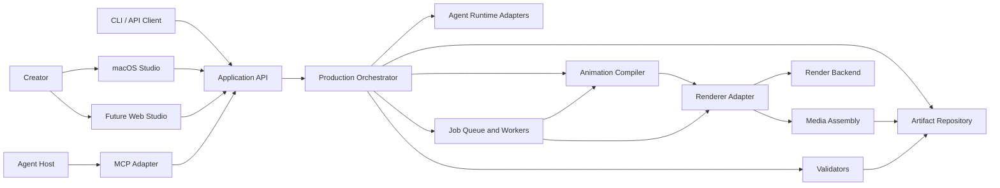

# RigTale System Design

**Status:** v1 draft.

## Design Goal

RigTale must support an agent-operated, structured animation studio that remains practical for one developer to maintain and one creator to run locally. Stable production contracts separate creative authoring, deterministic animation compilation, rendering, and product surfaces so later web, cloud, MCP, or alternative-renderer support does not replace the production model.

## Design Constraints

- Primary production is multi-character 2D cutout animation with layered compositing.
- Agents produce structured direction; deterministic software validates, compiles, and renders it.
- Existing approved productions remain editable and renderable without an AI provider.
- Assets, contracts, builds, and renders are versioned and reproducible.
- Unsupported actions and incompatible assets fail explicitly.
- Local macOS operation is required; cloud and web operation are compatible extensions.
- Renderer, server language, serialization technology, and database are not selected without evidence.

## Logical Topology



This is a logical decomposition. Local deployment may run all components in one application and supervised child processes. Cloud deployment may separate the same interfaces into services and workers.

## Components

### Product Surfaces

#### macOS Studio

A native Swift application is the primary local operator surface. It owns project navigation, asset inspection, production state, review media, structured corrections, approvals, render control, diagnostics, and local configuration. It communicates through application APIs rather than reading engine internals directly.

#### Web Studio

A future TypeScript and Vite application presents compatible workflows through remote APIs. It does not establish a separate production format. Vitest is a test tool, not the application framework.

#### CLI, API, and MCP

CLI and API provide repeatable automation and integration. MCP exposes selected application tools to compatible agent hosts. All surfaces share contracts, validation, job state, and permissions.

### Application API

Defines use-case-oriented operations such as create production, publish artifact, validate shot, compile affected shots, request preview, record finding, approve gate, and render delivery. It handles authentication context, idempotency, request validation, and result references.

The transport protocol and server language are decision-pending. Local in-process calls, local IPC, HTTP, and MCP may coexist behind the same application operation definitions.

### Production Orchestrator

Coordinates artifact lifecycles and pipeline gates. It computes dependencies, rejects stale inputs, schedules deterministic work, invokes agent adapters only when creative reasoning is required, and records audit events. It contains no renderer-specific animation logic.

### Artifact Repository

Stores immutable published artifacts, working versions, media, manifests, reports, indexes, and dependency graphs. It provides atomic publication, content-digest lookup, migration, backup, restore, and garbage-collection policy.

Local storage may initially combine filesystem objects with an embedded index. Cloud storage may use object storage and a transactional metadata database. The logical repository interface must remain the same.

### Asset Registry

Indexes published character, scene, prop, motion, and media packs by capability, compatibility, provenance, license, and quality status. It resolves exact versions for an episode `AssetLock` and supplies only compatible choices to planning tools.

### Agent Runtime Adapters

Connect external hosts or embedded providers to typed Studio and Red-Team tools. They manage bounded context, provider configuration, retries, budgets, and run records. They do not own production truth.

### Validators

Run schema, compatibility, capability, dependency, timing, licensing, composition, media, and delivery rules. Validators are versioned, deterministic where possible, and emit structured findings. Visual learned or agent-assisted checks are advisory until confirmed by deterministic or human review policy.

### Animation Compiler

Transforms valid semantic `ShotPlan` artifacts and exact asset locks into immutable `CompiledShot` artifacts. Its final internal architecture is evidence-pending under `SPIKE-A001`. It must preserve source mapping, determinism, diagnostics, and backend independence.

### Renderer Adapter

Translates a supported compiled contract into backend execution. It declares capabilities, accepted versions, resource requirements, preview/final profiles, and diagnostic mapping. A backend may be an existing engine, DCC, runtime, or later custom implementation; none is selected in this draft.

### Job System

Executes expensive and resumable compilation, preview, render, media, validation, and migration work. Jobs have immutable input locks, idempotency keys, state transitions, heartbeats, attempts, resource limits, cancellation, and output manifests.

### Media Assembly

Assembles shot output, audio, captions, thumbnails where required, encodes delivery profiles, and emits QC measurements and a `DeliveryManifest`. It never becomes the only copy of editable production state.

## Core Data Flow

1. A surface creates or selects a versioned production.
2. The Studio Agent or user writes bounded creative artifacts through application tools.
3. The orchestrator validates and publishes approved artifacts.
4. Asset resolution creates an immutable dependency lock.
5. Shot plans pass schema, capability, continuity, and timing validation.
6. The compiler produces exact `CompiledShot` artifacts with source maps and digests.
7. Preview jobs render review media and validation evidence.
8. Red-Team and human findings produce structured corrections and new versions.
9. Approved compiled shots render independently and resume after failure.
10. Media assembly creates delivery artifacts, QC, attribution, and archive metadata.

## Job State Model

```text
queued -> preparing -> running -> succeeded
                         |-> retryable_failure -> queued
                         |-> blocked
                         |-> failed
                         \-> cancelled
```

Every transition is persisted. A process crash may leave a lease expired but must not mark incomplete output successful. Published output appears atomically only after manifest validation.

## Local Deployment

The macOS application hosts lightweight orchestration and uses supervised worker processes where engine isolation or crash recovery requires it. A local project directory or managed workspace contains artifacts and media; a local index accelerates queries but is rebuildable from canonical manifests.

Local mode must support:

- creation, editing, validation, preview, and final rendering without a remote control plane;
- optional external AI providers for new creative work;
- deterministic work while offline;
- explicit CPU, GPU, disk, and concurrency limits; and
- exportable, restorable project archives.

Exact process, IPC, sandbox, signing, and packaging choices require `SPIKE-I001` and renderer evidence.

## Cloud Evolution

Cloud mode separates stateless APIs, metadata, object storage, orchestration, agent runs, and render workers while retaining local-compatible artifacts. User and organization tenancy, billing, marketplace, and enterprise policy are not early product requirements, but the design must not embed machine-local paths or secrets into durable contracts.

The web client is an operator surface over the cloud application API. Local projects may later sync or upload through explicit version and conflict rules; transparent bidirectional sync is not assumed.

## Extension Boundaries

Provider, importer, validator, compiler feature, renderer, storage, queue, and delivery integrations must declare:

- adapter identity and version;
- supported contract and feature versions;
- deterministic versus external behavior;
- configuration and secret requirements;
- diagnostics and health checks; and
- migration or fallback behavior.

Extensions cannot weaken core validation or modify published artifacts in place.

## Security Boundaries

- User-supplied media, layered files, fonts, archives, project files, and URLs are untrusted. `RGT-S014` established the concrete attack surface: `psd-tools` carries a 2026 arbitrary-file-write advisory, ImageMagick has 739 Debian advisory records, and ZIP-based containers such as `.ora` and `.kra` carry attacker-controlled internal paths. Ingestion must defend against path traversal, decompression ratio, nesting depth, and length-field overflow, and the parser choice must be justified on memory safety.
- Third-party engines and repository experiments run without production secrets.
- Media parsing and rendering should use isolated processes with bounded resources.
- Durable artifacts contain references to secrets, never secret values.
- Local and cloud authorization checks occur in application operations, not only in UI controls.
- Logs redact credentials, local private paths where appropriate, and provider payloads containing sensitive content.
- Asset license and provenance checks block distribution when evidence is missing or incompatible.

## Observability and Reproducibility

Every production action receives a correlation ID and records artifact versions, actor, tool or component version, job attempt, durations, resource measurements, findings, and output digests. Render manifests capture sufficient environment and dependency information to reproduce or explain differences.

Telemetry is local-first and inspectable. Remote telemetry is opt-in unless required by a configured hosted service and must be documented.

## Deferred Decisions

| Decision | Required evidence |
|---|---|
| Source asset, layered ingestion, rig publication, and derived conversion | `SPIKE-A002` |
| Orchestration, motion, interaction, and compiled timeline model | `SPIKE-A001` and joint execution in `SPIKE-R001` |
| Primary renderer and adapter boundary | Qualification from `SPIKE-R001`, parity from `SPIKE-R002`, Swift integration from `SPIKE-I001`, then final `RGT-D010` |
| Server and core implementation languages, schema tooling, and local storage baseline | `SPIKE-CS001` and `RGT-D012`, informed by repository reviews, `SPIKE-R001`, and `SPIKE-I001` |
| macOS process and engine integration | `SPIKE-I001` |
| Preview implementation | `SPIKE-R002` |
| Serialization, schema, migration, and local metadata store | `SPIKE-CS001` and `RGT-D012` |
| Cloud database | Later query, migration, backup, tenancy, and scale evidence before hosted implementation |
| MCP host behavior and embedded agent framework | `SPIKE-M001`; it does not block the core local animation path |
| Queue, object storage, and cloud deployment providers | operational workload evidence |

## v1 Draft Exit Criteria

- Every logical component has one responsibility and explicit inputs or outputs.
- Local and cloud modes share production contracts.
- Agent, compiler, renderer, and storage boundaries remain independently replaceable.
- Failure, recovery, security, and observability are designed before implementation.
- Every unselected technology is linked to evidence work rather than implied by examples.
